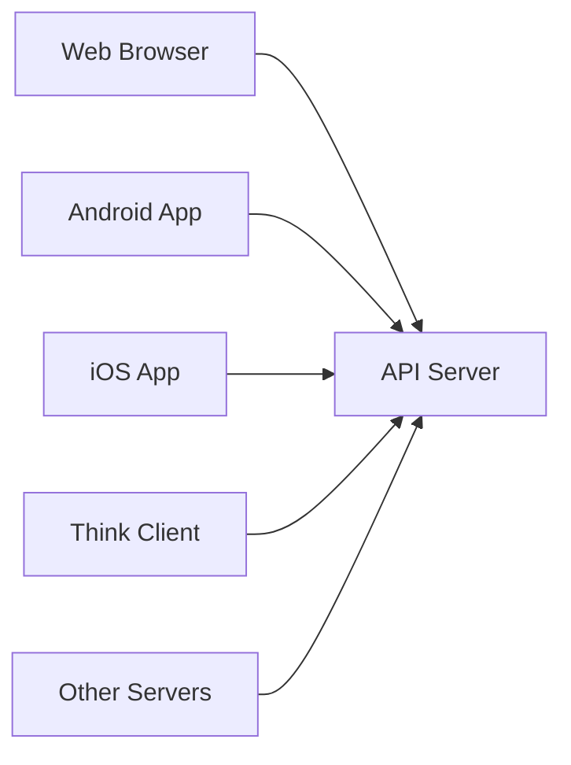

# 📘 API (Application Programming Interface)

---

### 🔹 **API Full Form**: Application Programming Interface

> A **bridge** that lets two software systems talk to each other 🔗

---

### 🧠 **Core Concept**:

* API = A system of **Request + Response**
* Client (browser/app) sends a request → Server responds with data (via API)

---

### 🔥 **Key Points**:

- ✅ **80% of websites run on APIs**
- ✅ **APIs use HTTP/HTTPS protocols**
- ✅ **They run on web servers like Apache, NGINX, etc.**
- ✅ **Data is usually returned in JSON or XML format**
- ✅ **REST API is the most common (lightweight & fast)**

---

### 📦 **Data Formats**:

* `JSON` → JavaScript Object Notation (most widely used)
* `XML` → Older format
* `Plain Text` → Sometimes visible in Burp Suite responses

---

### 🛠 **In Burp Suite**:

* **Request tab**: Shows how the API is called (headers, parameters)
* **Response tab**: Shows API data in **JSON** or **Plain Text**

> Burp Suite lets you **analyze the full API communication**

---

### 🧪 **OWASP Juice Shop**:

* A **vulnerable web app lab** for practice
* It also contains **hidden REST APIs**
* When tested, it shows **JSON responses**

> Perfect for learning API hacking and testing 🔓

---

# HTTP Client / User-Agent to HTTP Servers

```plaintext
+--------------------+       +---------------------+
|                    | ----> | Web HTTP Server     |
| HTTP Client        | <---- |                     |
| User-Agent         |       +---------------------+
+--------------------+       |                     |
|                    | ----> | Mini Web HTTP Server|
| HTTP Client        | <---- |                     |
| User-Agent         |       +---------------------+
+--------------------+       |                     |
|                    | ----> | Android HTTP Server |
| HTTP Client        | <---- |                     |
| User-Agent         |       +---------------------+
+--------------------+       |                     |
|                    | ----> | iOS HTTP Server     |
| HTTP Client        | <---- |                     |
| User-Agent         |       +---------------------+
+--------------------+       |                     |
|                    | ----> | HTTP Server         |
| HTTP Server        | <---- |                     |
+--------------------+       +---------------------+
```


