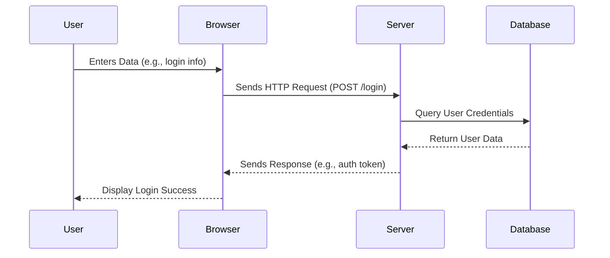
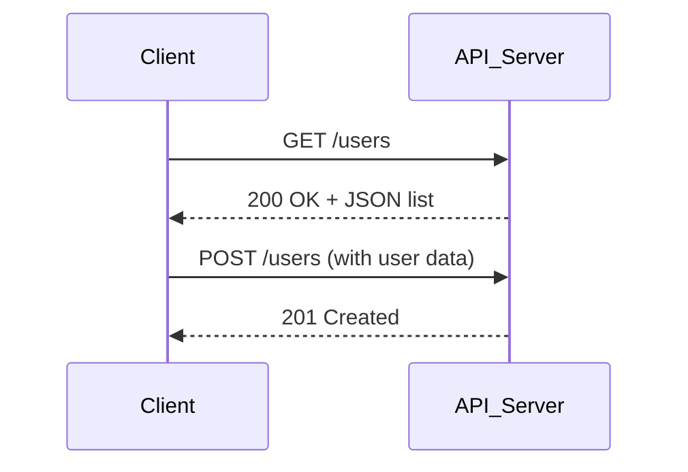
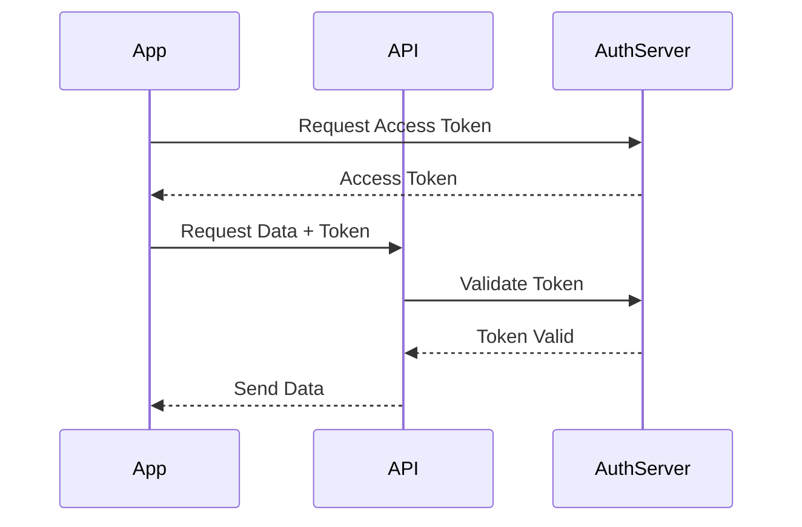

```mermaid
sequenceDiagram
    participant User
    participant Browser
    participant Server
    participant Database

    User->>Browser: Enters Data (e.g., login info)
    Browser->>Server: Sends HTTP Request (POST /login)
    Server->>Database: Query User Credentials
    Database-->>Server: Return User Data
    Server-->>Browser: Sends Response (e.g., auth token)
    Browser-->>User: Display Login Success
```

```mermaid
sequenceDiagram
    participant Client
    participant API_Server

    Client->>API_Server: GET /users
    API_Server-->>Client: 200 OK + JSON list

    Client->>API_Server: POST /users (with user data)
    API_Server-->>Client: 201 Created

```

```mermaid

sequenceDiagram
    participant App
    participant API
    participant AuthServer

    App->>AuthServer: Request Access Token
    AuthServer-->>App: Access Token
    App->>API: Request Data + Token
    API->>AuthServer: Validate Token
    AuthServer-->>API: Token Valid
    API-->>App: Send Data

```

